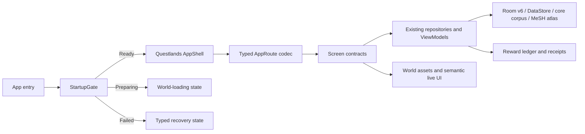

# برنامهٔ اجرایی

## اصل اجرا

بازسازی به‌صورت strangler و افزایشی انجام می‌شود: ابتدا shell و قراردادهای typed در کنار مسیرهای فعلی ساخته می‌شوند؛ سپس surfaceها یک‌به‌یک با parity رفتاری و screenshot proof جایگزین می‌شوند. هیچ whole-file rewrite برای فایل‌های دارای corpus تألیفی مجاز نیست.

| فاز | وضعیت | خروجی و گیت خروج |
|---|---|---|
| ۰. ممیزی مستقل | completed | ۱۴ یافته، JSON/Markdown/PDF فریز، ۲۰ صفحه بازرسی بصری |
| ۱. موجودی موازی | completed | route/state/coupling، داده/migration و شواهد بصری |
| ۲. قرارداد حفظ | completed | Room v6، corpus، catalog، route، embedded content و rollback ثبت شد |
| ۲.۵. توسعهٔ data plane | implemented؛ Jules audit active | MeSH 2026 Reference Atlas با ۵٬۷۴۲ descriptor، Room v6، validator، CI و runtime proof |
| ۳. preview canonical | blocked by ImageGen OAuth | boardهای Questlands و asset manifest؛ تأیید صریح کاربر |
| ۴. foundation architecture | pending approval | typed routes، StartupGate، responsive shell، theme/tokens، screen contracts |
| ۵. world asset system | pending approval | mascot family، world map، badges، icons، celebration، reduced-motion variants |
| ۶. route-by-route rebuild | pending approval | Home، Library، Practice، Journey، Profile، جزئیات و بازی‌ها |
| ۷. gamification presentation | pending approval | quest، achievement، reward presentation و progression فقط از evidence |
| ۸. hardening | pending | state matrices، recovery، accessibility، RTL/LTR، performance و Android lifecycle |
| ۹. release evidence | pending external gates | signed upgrade، gateway/session، physical-device profile و content approval |

## ترتیب سطح‌ها پس از تأیید preview

1. `AppShell`، `StartupGate` و typed `AppRoute`.
2. Home/Today و Questboard چون cadence و next action را تعریف می‌کنند.
3. Library/Lexicon و Entry چون شناسه‌های داده حساس‌اند.
4. Practice و Review چون settlement و replay را لمس می‌کنند.
5. Journey/Gamification Hub و reward presentation.
6. Clinical/Fluency/Roleplay با حفظ safety و offline boundary.
7. Profile/Cabinet و preferenceها.
8. splash، adaptive icon، motion bible و polish کل‌محصول.

## معماری هدف

## محدودیت‌های غیرقابل مذاکره

- UI حق نوشتن مستقیم XP، achievement، quest completion یا reward balance ندارد.
- route label نمایشی شناسهٔ پایدار نیست.
- uninstall، `pm clear`، destructive migration و reset داده ممنوع است.
- فایل‌های بزرگ حاوی corpus باید ابتدا extract/test شوند، سپس شکسته شوند.
- no-op، spinner بی‌نهایت و silent fallback به scenario دیگر پذیرفته نیست.
- حذف shell قدیمی تنها پس از route parity، screenshot matrix و rollback patch مجاز است.
